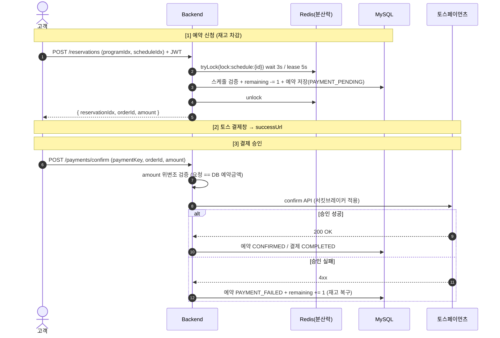
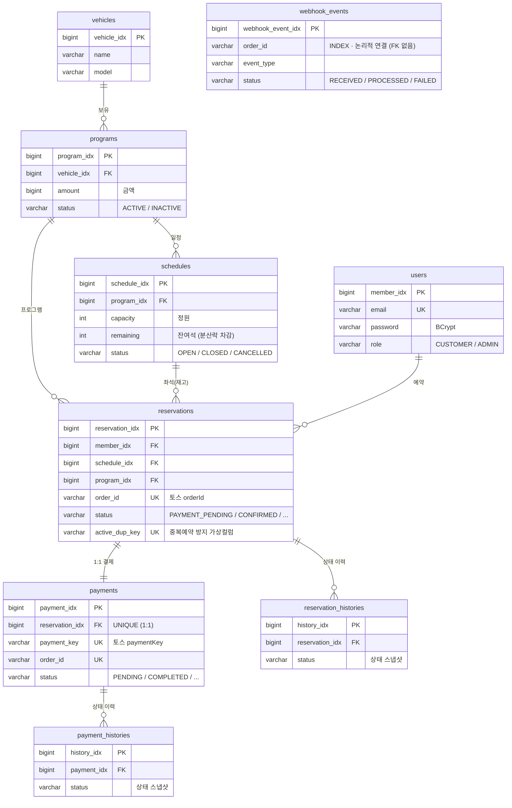

# 드라이빙 프로그램 예약 시스템

> BMW·아우디 드라이빙 센터 같은 **유료 체험 프로그램 예약 서비스**.
> 한정된 좌석을 두고 동시 예약이 몰리는 상황에서 **재고 동시성 제어**와, 외부 PG(토스페이먼츠) 장애에도 흔들리지 않는 **결제 복원력**을 직접 설계·검증하는 데 초점을 둔 백엔드 프로젝트입니다.


> ⚠️ **개발 진행 중** — 회원/프로그램/예약 신청(분산락)/결제 승인·웹훅·만료까지 구현 완료.
> 예약 변경·취소, 어드민은 진행 예정입니다. (하단 [로드맵](#로드맵) 참고)

---

## 1. 무엇을, 왜 이렇게 만들었나

이 프로젝트의 가치는 기능 개수가 아니라 **"왜 이 설계인가"** 에 있습니다.
실무(SI)에서 깊이 다루기 어려운 **동시성 제어·외부 API 복원력·통합 테스트**를 학습 목표로 삼아, 모든 핵심 결정에 근거를 남겼습니다.

### 기술적 도전 ① — 재고 동시성 제어 (Redis 분산락)

같은 스케줄(좌석)에 예약이 동시에 몰리면 `schedules.remaining` 차감에 race condition이 발생합니다.

- **DB 비관락(`SELECT FOR UPDATE`) 대신 Redis 분산락(Redisson)** 선택 — 멀티 인스턴스 환경에서 DB 커넥션을 점유하지 않고 단일 진입점을 보장하기 위함.
- **락이 트랜잭션을 감싸는 순서** (`tryLock → TransactionTemplate → unlock`) — `@Transactional` 안에서 락을 잡으면 커밋 전에 락이 풀려 차감 전 상태를 다시 읽는 문제가 생기므로, 락이 트랜잭션을 바깥에서 감싸도록 명시적으로 구성.
- **`tryLock(wait 3s, lease 5s)`** — 임의값이 아니라 UX 임계점(3초)과 실측 DB 작업 시간의 안전 마진(5초)에서 도출. `leaseTime`을 명시해 watchdog 자동 갱신을 끄고 장애 시 자동 복구 보장.
- **락 키는 `schedule_idx` 단위** — 경합은 같은 좌석을 노리는 서로 다른 사용자 사이에서 발생하므로 회원 단위 락은 의미 없음.

→ 멀티스레드 **동시성 통합 테스트**로 재고 초과 차감이 발생하지 않음을 검증.

### 기술적 도전 ② — 결제 복원력 (Resilience4j 서킷브레이커)

외부 PG(토스페이먼츠) confirm API는 우리가 통제할 수 없는 장애 지점입니다.

- 토스 confirm 호출에 **서킷브레이커**를 적용해, 장애가 누적되면 빠르게 실패(fast-fail)시키고 시스템 전체로 장애가 번지는 것을 차단.
- **WireMock으로 토스 API를 HTTP 레벨에서 목킹**해 서킷이 실제로 OPEN으로 트립되는지까지 테스트로 검증.
- confirm 트랜잭션을 `@Transactional` 빈으로 분리해 결제 승인/실패 시 상태 전이와 이력 적재의 원자성 확보.

### 기술적 도전 ③ — 미결제 만료 정책 (웹훅 1차 + 스케줄러 안전망)

토스가 결제를 `EXPIRED` 처리해도 **우리 DB의 예약/재고는 자동으로 풀리지 않습니다.** 외부 시스템의 보장되지 않는 동작에 대한 방어적 설계가 필요합니다.

- **1차 — 토스 웹훅**: `PAYMENT_STATUS_CHANGED(EXPIRED)` 수신 시 실시간으로 예약 만료 + 재고 복구.
- **2차 — 스케줄러 안전망**: `reservedAt + 40분` 초과 좀비 예약을 주기적으로 청소 (웹훅 유실/서버 다운 대비).
- **멱등성**: `webhook_events.order_id` 중복 체크 + `Reservation.expire()`의 상태 가드로, 웹훅과 스케줄러가 같은 건을 처리해도 **재고 중복 복구를 방지**.
- **재고 복구 단일 책임**: 결제 상태가 아니라 **예약 상태 전이(`fail`/`cancel`/`expire`)에서만** `remaining += 1` 하여 복구 로직을 한 곳에 모음.

---

## 2. 결제 흐름



> 결제 실패·만료·웹훅 등 전체 시퀀스: [`docs/payment-sequence.md`](docs/payment-sequence.md)

---

## 3. 기술 스택

| 구분 | 기술 |
|------|------|
| Language | Java 25 |
| Framework | Spring Boot 4.0, Spring Security, Spring Data JDBC |
| Database | MySQL 8.x |
| Cache / Lock | Redis (Redisson 분산락) |
| Resilience | Resilience4j 2.3 (서킷브레이커) |
| Auth | JWT (jjwt 0.12.6) + Redis 기반 토큰 블랙리스트/리프레시 |
| Payment | 토스페이먼츠 API |
| Docs | springdoc-openapi (Swagger UI) |
| Test | JUnit 5, Mockito, **TestContainers**(MySQL+Redis), **WireMock**, **Fixture Monkey** |
| Build | Gradle (Kotlin DSL) |

**Spring Data JDBC를 택한 이유**: JPA의 영속성 컨텍스트·지연 로딩 등 암묵적 동작을 걷어내고 SQL 실행 시점을 명확히 파악하며 학습하기 위함. (JPA 미사용)

---

## 4. 주요 API

| 메서드 | 엔드포인트 | 설명 | 인증 |
|--------|-----------|------|------|
| POST | `/auth/signup` | 회원가입 | — |
| POST | `/auth/login` | 로그인 | — |
| POST | `/auth/logout` | 로그아웃 (토큰 블랙리스트) | ✅ |
| GET | `/programs` | 프로그램 목록 | — |
| GET | `/programs/{id}` | 프로그램 상세 | — |
| POST | `/reservations` | 예약 신청 (분산락 + 재고 차감) | ✅ |
| POST | `/payments/confirm` | 결제 승인 | ✅ |
| POST | `/payments/webhook` | 토스 웹훅 수신 (만료/상태 보정) | — |

---

## 5. 도메인 / 패키지 구조

```
src/main/java/com/example/driving/
├── member/        # 회원 (가입/로그인, JWT)
├── program/       # 차량·프로그램·스케줄(재고)
├── reservation/   # 예약 신청·만료 스케줄러
├── payment/       # 토스 연동·결제 승인·웹훅·서킷브레이커
└── common/        # config, security, exception, response
```

도메인 로직은 도메인 객체 안에 두고(서비스는 오케스트레이션), 엔티티는 정적 팩토리/상태 전이 메서드로만 변경합니다.

### 데이터 모델 (ERD)



> `webhook_events`는 예외 상황 대비 안전망이라 참조 무결성보다 유연성을 우선해 **FK 없이 `order_id`로 느슨하게 연결**합니다.

상세 컬럼 정의 + 인덱스 설계: [`docs/erd.md`](docs/erd.md)

---

## 6. 테스트

동시성·외부 API 장애·만료 경쟁 등 **"눈에 안 보이는 동작"을 테스트로 증명**하는 데 집중했습니다.

- **동시성 통합 테스트** — 멀티스레드로 동시 예약/결제 시 재고 초과 차감이 없음을 검증
- **서킷브레이커 테스트** — WireMock으로 토스 API 장애를 재현해 서킷 트립 검증
- **웹훅/만료 통합 테스트** — TestContainers(MySQL+Redis)로 실제 인프라 기반 검증
- **Fixture Monkey** — 이모지/다국어/경계값 등 다양한 입력 자동 생성

```bash
./gradlew test
```

---

## 7. 실행 방법

```bash
# 1. MySQL + Redis 기동
docker-compose up -d

# 2. 로컬 프로파일로 실행
./gradlew bootRun --args='--spring.profiles.active=local'

# 3. Swagger UI
# http://localhost:8080/swagger-ui.html
```

---

## 로드맵

- [x] 회원가입 / 로그인 / 로그아웃 (JWT + Redis)
- [x] 프로그램 조회
- [x] 예약 신청 + Redis 분산락 + 동시성 테스트
- [x] 토스페이먼츠 결제 승인 + 서킷브레이커
- [x] 결제 웹훅 + 미결제 만료(웹훅 1차 + 스케줄러 안전망)
- [ ] 예약 변경 / 취소 (+ 환불)
- [ ] 어드민 (프로그램·스케줄 관리)
- [ ] CI/CD (Docker + EKS)

---

## 설계 문서

| 문서 | 내용 |
|------|------|
| [`docs/payment-sequence.md`](docs/payment-sequence.md) | 결제/웹훅/만료 시퀀스 다이어그램 |
| [`docs/erd.md`](docs/erd.md) | 데이터 모델 + 인덱스 설계 |
| [`docs/testcontainers.md`](docs/testcontainers.md) | 통합 테스트 환경 |
