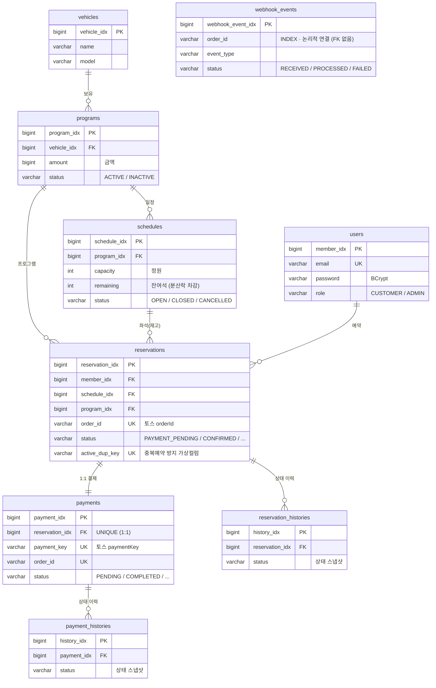

# ERD 컬럼 정의

> 드라이빙 프로그램 예약 시스템 데이터 모델. CLAUDE.md에서 분리(2026-05-29).
> 실제 스키마는 도메인 엔티티(`@Table`)와 마이그레이션 기준.

## 관계도

## users
| 컬럼 | 타입 | 비고 |
|------|------|------|
| member_idx | BIGINT | PK, AUTO_INCREMENT |
| email | VARCHAR(100) | 평문 (INDEX) |
| password | VARCHAR(60) | BCrypt 단방향 |
| name | VARCHAR(255) | 평문 저장 가능 (멘토 확인 — AES 암호화는 선택사항) |
| phone | VARCHAR(255) | 평문 저장 가능 (멘토 확인 — AES 암호화는 선택사항) |
| role | VARCHAR(20) | CUSTOMER / ADMIN |
| created_at | DATETIME | |
| updated_at | DATETIME | |
| deleted_at | DATETIME | nullable |

## vehicles
| 컬럼 | 타입 | 비고 |
|------|------|------|
| vehicle_idx | BIGINT | PK, AUTO_INCREMENT |
| name | VARCHAR(100) | |
| model | VARCHAR(100) | |
| created_at | DATETIME | |
| updated_at | DATETIME | |

## programs
| 컬럼 | 타입 | 비고 |
|------|------|------|
| program_idx | BIGINT | PK, AUTO_INCREMENT |
| vehicle_idx | BIGINT | FK → vehicles |
| name | VARCHAR(100) | |
| duration | INT | 진행시간(분) |
| amount | BIGINT | 금액 |
| status | VARCHAR(20) | ACTIVE / INACTIVE |
| created_at | DATETIME | |
| updated_at | DATETIME | |

## schedules
| 컬럼 | 타입 | 비고 |
|------|------|------|
| schedule_idx | BIGINT | PK, AUTO_INCREMENT |
| program_idx | BIGINT | FK → programs |
| start_at | DATETIME | |
| end_at | DATETIME | |
| capacity | INT | 정원 |
| remaining | INT | 잔여석 (분산락으로 차감) |
| status | VARCHAR(20) | OPEN / CLOSED / CANCELLED |
| created_at | DATETIME | |
| updated_at | DATETIME | |

## reservations
| 컬럼 | 타입 | 비고 |
|------|------|------|
| reservation_idx | BIGINT | PK, AUTO_INCREMENT |
| member_idx | BIGINT | FK → users |
| program_idx | BIGINT | FK → programs |
| schedule_idx | BIGINT | FK → schedules |
| order_id | VARCHAR(64) | UNIQUE (토스 orderId) |
| amount | BIGINT | |
| status | VARCHAR(20) | ReservationStatus |
| reserved_at | DATETIME | NOT NULL |
| created_at | DATETIME | |
| updated_at | DATETIME | |

## payments
| 컬럼 | 타입 | 비고 |
|------|------|------|
| payment_idx | BIGINT | PK, AUTO_INCREMENT |
| reservation_idx | BIGINT | FK, UNIQUE → reservations |
| payment_key | VARCHAR(200) | UNIQUE (토스 paymentKey) |
| order_id | VARCHAR(64) | UNIQUE |
| amount | BIGINT | |
| status | VARCHAR(20) | PaymentStatus |
| failure_code | VARCHAR(50) | nullable |
| failure_message | VARCHAR(255) | nullable |
| requested_at | DATETIME | nullable |
| approved_at | DATETIME | nullable |
| created_at | DATETIME | |
| updated_at | DATETIME | |

## reservation_histories / payment_histories
| 컬럼 | 타입 | 비고 |
|------|------|------|
| history_idx | BIGINT | PK, AUTO_INCREMENT |
| reservation_idx / payment_idx | BIGINT | FK |
| status | VARCHAR(20) | 상태 스냅샷 |
| created_at | DATETIME | |

## webhook_events
| 컬럼 | 타입 | 비고 |
|------|------|------|
| webhook_event_idx | BIGINT | PK, AUTO_INCREMENT |
| event_type | VARCHAR(50) | PAYMENT_STATUS_CHANGED / CANCEL_STATUS_CHANGED |
| order_id | VARCHAR(64) | nullable, INDEX (payments/reservations 조회용) |
| raw_payload | TEXT | 토스 웹훅 원문 JSON |
| status | VARCHAR(20) | RECEIVED / PROCESSED / FAILED |
| created_at | DATETIME | |

> FK 없음 — 웹훅은 예외 상황 대비 안전망이므로 참조 무결성보다 유연성 우선. order_id로 payments/reservations 조회.

## 인덱스 설계 (멘토 피드백 반영)

| 테이블 | 인덱스 컬럼 | 용도 |
|--------|------------|------|
| users | `email` | 로그인 시 이메일 조회 |
| schedules | `program_idx`, `start_at` | 프로그램별 일정 목록 조회 |
| reservations | `member_idx` | 회원별 예약 목록 조회 |
| reservations | `order_id` | 결제 연동 시 orderId 조회 |
| payments | `order_id` | 결제 확인/웹훅 처리 |
| payments | `payment_key` | 결제 취소 시 paymentKey 조회 |
| webhook_events | `order_id` | 웹훅 이벤트 중복 처리 방지 |
