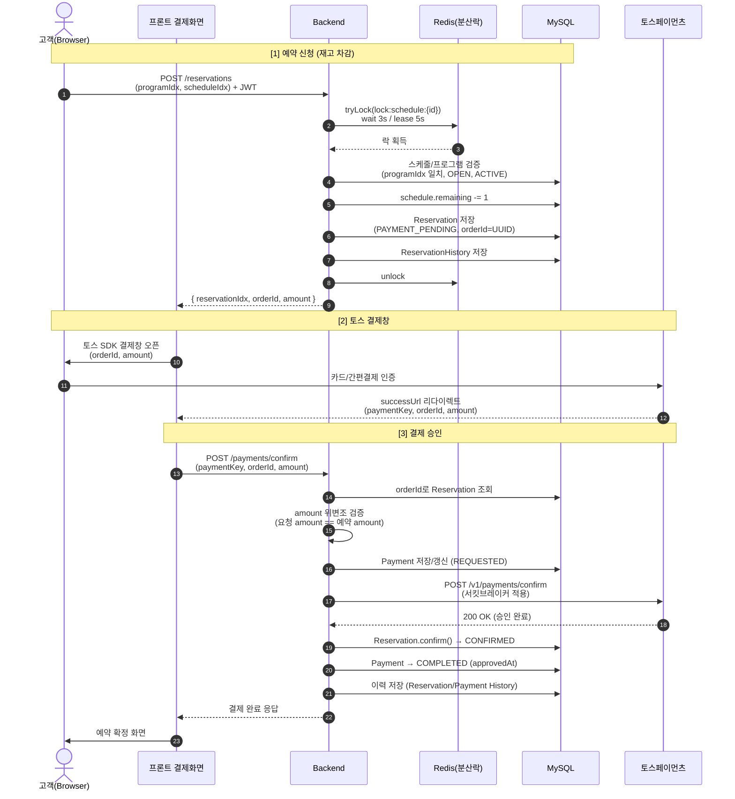
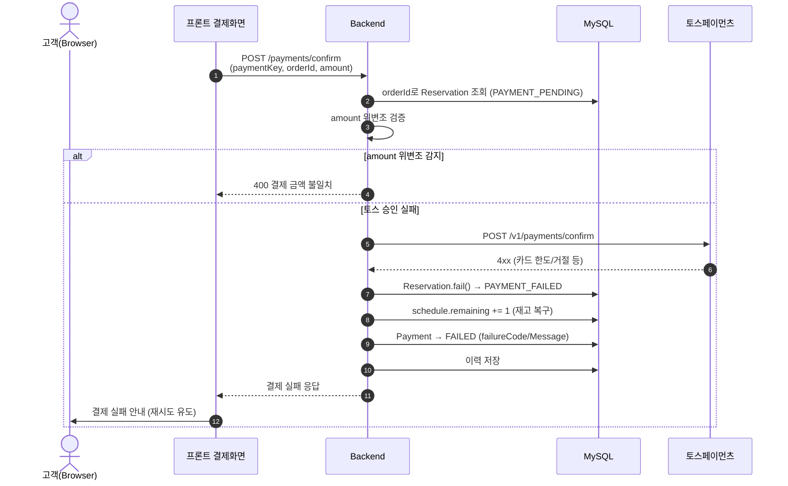
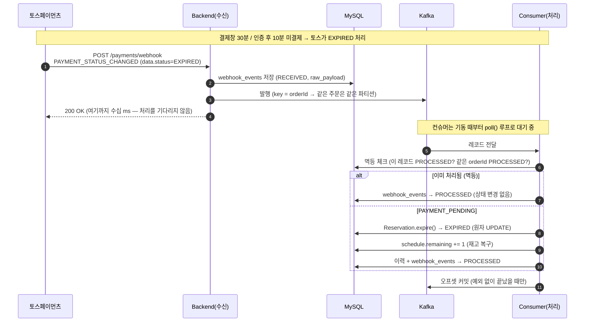
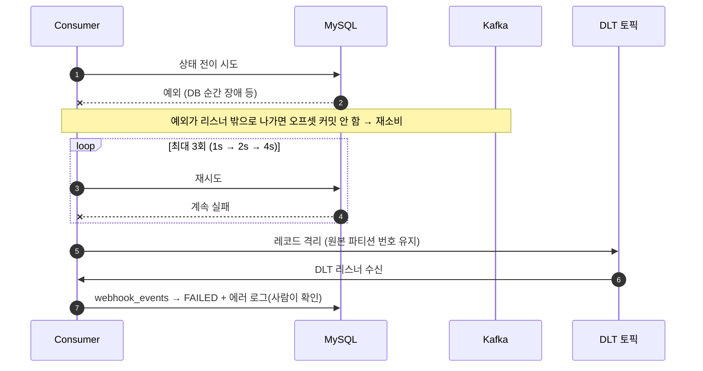
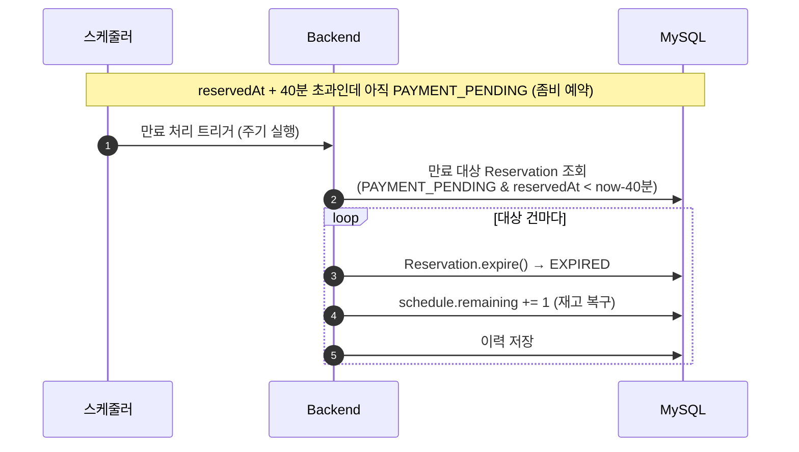
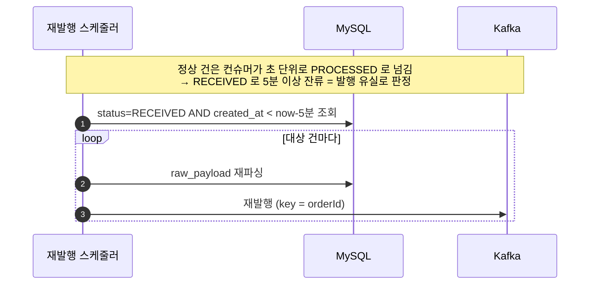
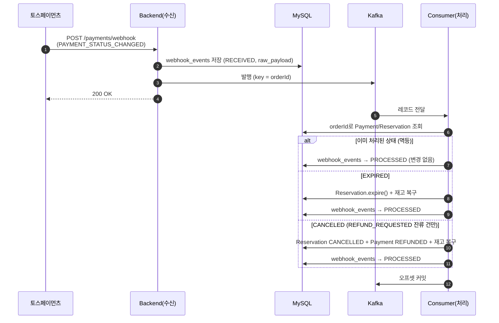

# 토스페이먼츠 결제 흐름 시퀀스 다이어그램

> 3주차 결제 연동 설계 문서 (멘토링 준비용)
> 작성: 2026-05-29

## 등장 요소

| 구분 | 설명 |
|------|------|
| **고객(Browser)** | 프론트 결제 화면, 토스 결제 SDK 위젯 |
| **Backend** | Spring Boot 서버 (ReservationService, PaymentService) |
| **Redis** | 분산락 (`lock:schedule:{scheduleIdx}`) |
| **MySQL** | reservations / schedules / payments 등 |
| **토스페이먼츠** | 외부 결제 PG (결제창, confirm API, 웹훅 발송) |
| **Kafka** | 웹훅 수신/처리 분리 (`payment.webhook.received`, 파티션 키 = orderId) |

상태 표기는 CLAUDE.md 기준:
- 예약: `PAYMENT_PENDING → CONFIRMED / PAYMENT_FAILED`
- 결제: `PENDING → REQUESTED → COMPLETED / FAILED`

---

## 1. 예약 신청 → 결제 → 확정 (정상 흐름)

---

## 2. 결제 실패 흐름 (재고 복구)

> **핵심 결정:** 재고 복구는 **예약 상태 변경 시점에서만** 처리 (결제 상태에서는 안 함).

### 미결제 만료 (웹훅 1차 + 스케줄러 안전망)

> **토스 만료 메커니즘 (2단계 타이머):**
> - ① 결제창 인증 **30분** 미인증 → `EXPIRED`
> - ② 인증 후(IN_PROGRESS) **10분** 내 confirm 미호출 → `EXPIRED`
>
> 토스가 결제를 EXPIRED 처리해도 **우리 예약/재고는 자동으로 안 풀림.** 우리 쪽 처리가 반드시 필요.

#### 1차: 토스 웹훅 (주 경로, 실시간)

수신과 처리를 Kafka로 나눈다. 토스가 응답을 기다리는 구간에서는 원문 보관과 발행만 하고,
상태 전이는 컨슈머가 별도 스레드에서 수행한다.

> **중복이거나 의미 처리 대상이 아닌 이벤트도 PROCESSED 로 마킹한다.** RECEIVED 로 두면 아래 3차
> 재발행 스케줄러가 계속 다시 발행해 순환에 빠진다.

#### 1차-실패: 재시도 → DLT 격리

> DLT 리스너는 **재고나 예약 상태를 임의로 건드리지 않는다.** 실패 원인을 모른 채 상태를 바꾸면
> 돈과 재고가 어긋난 채 덮인다. 격리해두고 원인을 확인한 뒤 재처리하는 편이 안전하다.
> 무한 재시도로 두지 않는 이유는 파티션이 순서대로 소비되기 때문 — 한 건이 계속 실패하면 뒤가 전부 밀린다.

#### 2차: 스케줄러 (안전망 — 웹훅 유실/미수신 대비)

#### 3차: 발행 유실 회수 (아웃박스 재발행)

수신 단계의 "DB 저장 → Kafka 발행"은 한 트랜잭션으로 묶을 수 없다(외부 시스템). 저장 직후 브로커가
죽거나 앱이 종료되면 이벤트가 RECEIVED 로 남은 채 아무도 처리하지 않는다. 그 흔적을 주워 재발행한다.

> `webhook_events` 테이블이 아웃박스 역할을 겸한다 — 감사 목적으로 원문을 보관하던 테이블을 재사용했다.
> 원래 발행이 뒤늦게 성공했다면 같은 이벤트가 두 번 소비되지만, 멱등 가드가 막는다. **유실보다 중복이 낫다.**

> **멱등성:** `webhook_events.order_id` 중복 체크 + `expire()`의 `isPaymentPending()` 가드로, 웹훅과 스케줄러가 같은 건을 처리해도 재고 중복 복구가 발생하지 않음. Kafka 는 at-least-once 라 중복 소비가 필연인데, 토스 재전송용으로 만든 이 가드가 그대로 쓰인다.
> **멀티 인스턴스 주의:** 스케줄러를 여러 인스턴스로 띄우면 분산락(Redisson)/ShedLock으로 단일 실행 보장.

---

## 3. 토스 웹훅 수신 (안전망)

> 프론트 confirm 호출이 누락/실패해도 결제 상태를 보정하기 위한 비동기 안전망.
> `webhook_events`에 원문 저장 후 멱등 처리 (order_id로 중복 방지).
> 상세 파이프라인(재시도·DLT·재발행)은 위 "미결제 만료" 절 참고 — 같은 경로를 공유한다.

의미 처리하는 이벤트는 `PAYMENT_STATUS_CHANGED` 두 가지다.

| data.status | 처리 |
|-------------|------|
| `EXPIRED` | 예약 만료 + 재고 복구 |
| `CANCELED` | cancel 호출에서 5xx(미확정)를 받아 `REFUND_REQUESTED` 로 잔류시킨 건을 확정 (CANCELLED + REFUNDED + 재고 복구) |

> **이 구조로 바꾼 이유:** 이전에는 처리 중 예외를 catch 로 삼키고 토스에 200 을 줬다. 토스는 재전송하지
> 않고, 만료 스케줄러는 PAYMENT_PENDING 예약만 훑는다. 그래서 **환불 보정에 실패한 건(`REFUND_REQUESTED`
> 잔류)은 어느 그물에도 걸리지 않았다** — 고객 돈은 환불됐는데 예약은 살아 있는 상태로 영구 잔류.
> 성능이 아니라 이 구멍을 막으려고 Kafka 를 넣었다.

---

## 설계 포인트 (멘토 설명용)

1. **orderId는 예약 신청 시 서버가 UUID로 생성** — 프론트가 임의 생성하지 않음(위변조 방어).
2. **amount 이중 검증** — confirm 요청의 amount와 DB에 저장된 예약 amount를 비교한 뒤 토스 confirm API 호출.
3. **재고 복구 단일 책임** — 결제 상태가 아니라 **예약 상태 전이(`fail`/`cancel`/`expire`)** 에서만 `remaining += 1`. 복구 로직이 한 곳에 모여 중복 복구를 방지.
4. **서킷브레이커(Resilience4j)** — 토스 confirm API 장애 시 빠른 실패 + 폴백 (3주차 적용 예정).
5. **웹훅 멱등성** — `webhook_events.order_id` 기준으로 동일 이벤트 중복 처리 방지.
6. **만료 정책 = 토스와 30분 일치 + 이중 처리** — 토스 결제창 30분/인증 후 10분 만료에 맞춰 우리 예약 만료도 30분 기준. 토스가 EXPIRED를 자동 처리해도 우리 예약/재고는 안 풀리므로, **웹훅(1차) + 스케줄러(안전망)** 로 처리. 외부 API의 보장되지 않는 동작(웹훅 유실 가능성)에 대한 방어적 설계.
7. **웹훅 수신/처리 분리(Kafka)** — 비동기화가 목적이 아니라 **실패한 이벤트를 다시 볼 곳을 만드는 것**이 목적. 처리에 실패하면 오프셋이 커밋되지 않아 재소비되고, 백오프 재시도(1s→2s→4s)를 소진하면 DLT 로 격리된다. `@Async` 로는 안 되는 이유는 메모리 큐라서 — 서버가 죽으면 처리 대기 중이던 건이 통째로 사라진다.
8. **파티션 키 = orderId** — 같은 주문의 이벤트(EXPIRED → CANCELED)는 순서가 뒤집히면 안 되고, 주문끼리는 순서를 지킬 이유가 없다. 지켜야 할 순서만 지키고 나머지는 병렬로.
9. **컨슈머 멱등성은 새로 만들지 않았다** — Kafka 는 at-least-once 라 중복 소비가 필연인데, 토스 재전송을 막으려고 만들어둔 `webhook_events.order_id` 체크 + 원자 UPDATE 가드가 그대로 작동한다. 같은 문제라서.

## 검증 (실측)

| 항목 | 결과 |
|------|------|
| 웹훅 응답시간 | 53ms (처리를 기다리지 않음) |
| 파티션 키 | orderId 7건이 파티션별로 해싱 분산, 같은 orderId 는 항상 같은 파티션 |
| 멱등성 | 같은 웹훅 5회 수신 → 전부 PROCESSED, 재고는 1회만 복구, 이력 1건 |
| 재시도 백오프 | 1s → 2.07s → 4.03s (설정값과 일치) |
| DLT | 4번째 실패 후 격리 + FAILED 마킹, 재고/예약은 원상태 유지 |
| 테스트 | 통합 125건 통과 (`WebhookRetryDltIntegrationTest`, `WebhookRepublishSchedulerIntegrationTest` 포함) |
