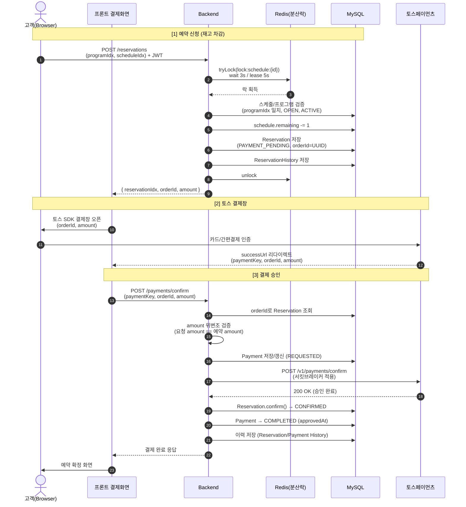
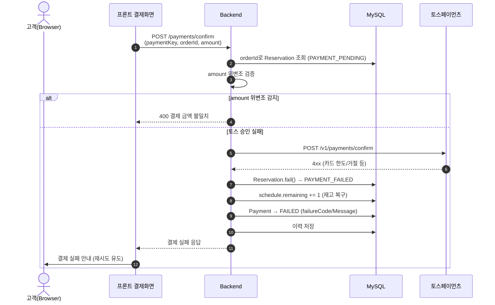
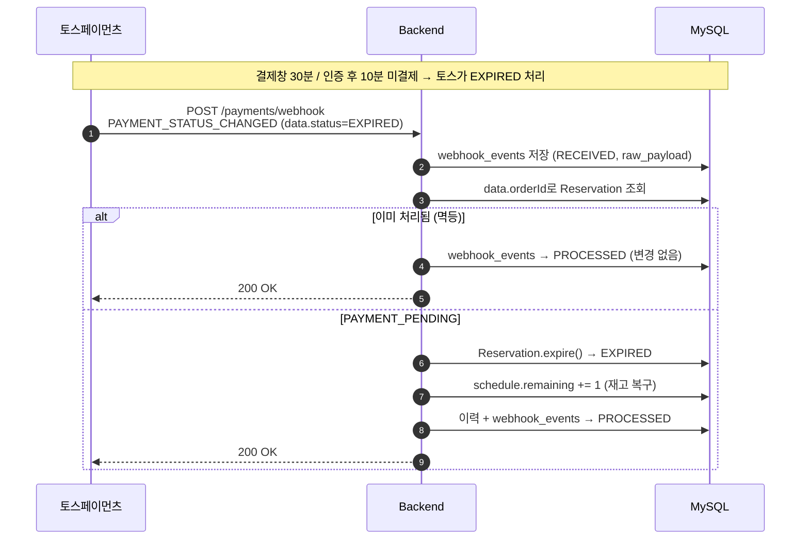
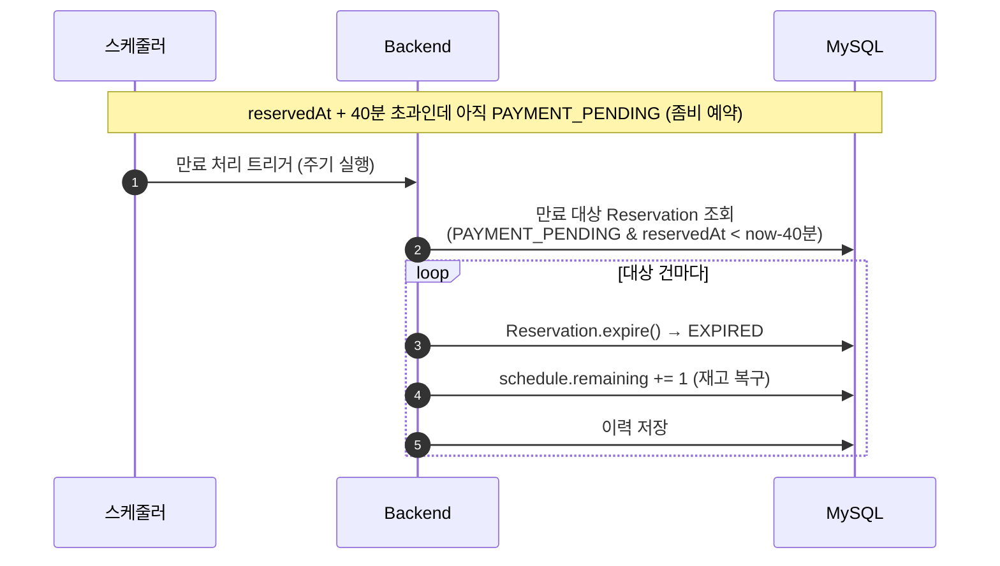
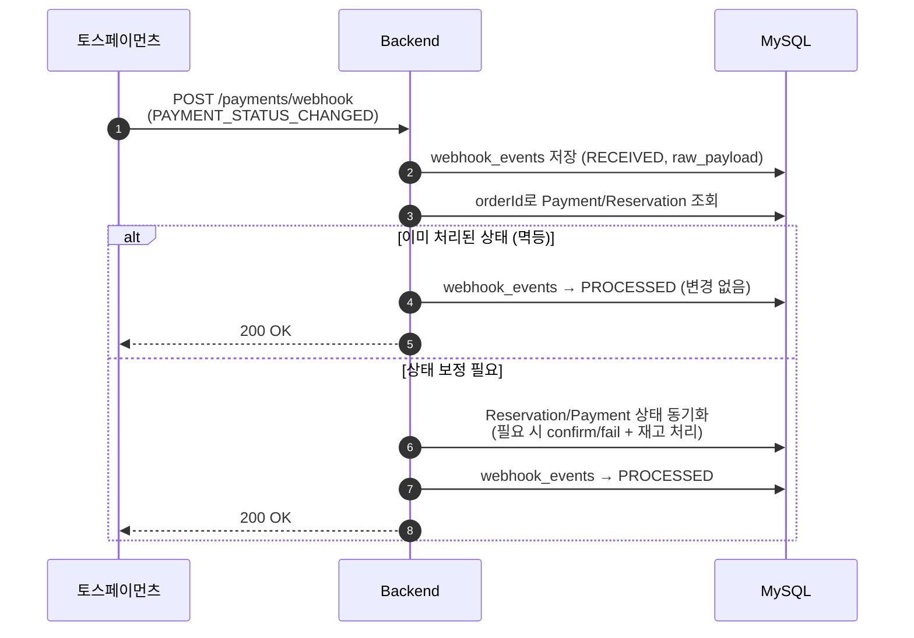

# 토스페이먼츠 결제 흐름 시퀀스 다이어그램

> 3주차 결제 연동 설계 문서 (멘토링 준비용)
> 작성: 2026-05-29

## 등장 요소

| 구분 | 설명 |
|------|------|
| **고객(Browser)** | 프론트 결제 화면, 토스 결제 SDK 위젯 |
| **Backend** | Spring Boot 서버 (ReservationService, PaymentService) |
| **Redis** | 분산락 (`lock:schedule:{scheduleIdx}`) |
| **MySQL** | reservations / schedules / payments 등 |
| **토스페이먼츠** | 외부 결제 PG (결제창, confirm API, 웹훅 발송) |

상태 표기는 CLAUDE.md 기준:
- 예약: `PAYMENT_PENDING → CONFIRMED / PAYMENT_FAILED`
- 결제: `PENDING → REQUESTED → COMPLETED / FAILED`

---

## 1. 예약 신청 → 결제 → 확정 (정상 흐름)

---

## 2. 결제 실패 흐름 (재고 복구)

> **핵심 결정:** 재고 복구는 **예약 상태 변경 시점에서만** 처리 (결제 상태에서는 안 함).

### 미결제 만료 (웹훅 1차 + 스케줄러 안전망)

> **토스 만료 메커니즘 (2단계 타이머):**
> - ① 결제창 인증 **30분** 미인증 → `EXPIRED`
> - ② 인증 후(IN_PROGRESS) **10분** 내 confirm 미호출 → `EXPIRED`
>
> 토스가 결제를 EXPIRED 처리해도 **우리 예약/재고는 자동으로 안 풀림.** 우리 쪽 처리가 반드시 필요.

#### 1차: 토스 웹훅 (주 경로, 실시간)

#### 2차: 스케줄러 (안전망 — 웹훅 유실/미수신 대비)

> **멱등성:** `webhook_events.order_id` 중복 체크 + `expire()`의 `isPaymentPending()` 가드로, 웹훅과 스케줄러가 같은 건을 처리해도 재고 중복 복구가 발생하지 않음.
> **멀티 인스턴스 주의:** 스케줄러를 여러 인스턴스로 띄우면 분산락(Redisson)/ShedLock으로 단일 실행 보장.

---

## 3. 토스 웹훅 수신 (안전망)

> 프론트 confirm 호출이 누락/실패해도 결제 상태를 보정하기 위한 비동기 안전망.
> `webhook_events`에 원문 저장 후 멱등 처리 (order_id로 중복 방지).

---

## 설계 포인트 (멘토 설명용)

1. **orderId는 예약 신청 시 서버가 UUID로 생성** — 프론트가 임의 생성하지 않음(위변조 방어).
2. **amount 이중 검증** — confirm 요청의 amount와 DB에 저장된 예약 amount를 비교한 뒤 토스 confirm API 호출.
3. **재고 복구 단일 책임** — 결제 상태가 아니라 **예약 상태 전이(`fail`/`cancel`/`expire`)** 에서만 `remaining += 1`. 복구 로직이 한 곳에 모여 중복 복구를 방지.
4. **서킷브레이커(Resilience4j)** — 토스 confirm API 장애 시 빠른 실패 + 폴백 (3주차 적용 예정).
5. **웹훅 멱등성** — `webhook_events.order_id` 기준으로 동일 이벤트 중복 처리 방지.
6. **만료 정책 = 토스와 30분 일치 + 이중 처리** — 토스 결제창 30분/인증 후 10분 만료에 맞춰 우리 예약 만료도 30분 기준. 토스가 EXPIRED를 자동 처리해도 우리 예약/재고는 안 풀리므로, **웹훅(1차) + 스케줄러(안전망)** 로 처리. 외부 API의 보장되지 않는 동작(웹훅 유실 가능성)에 대한 방어적 설계.
</content>
</invoke>
